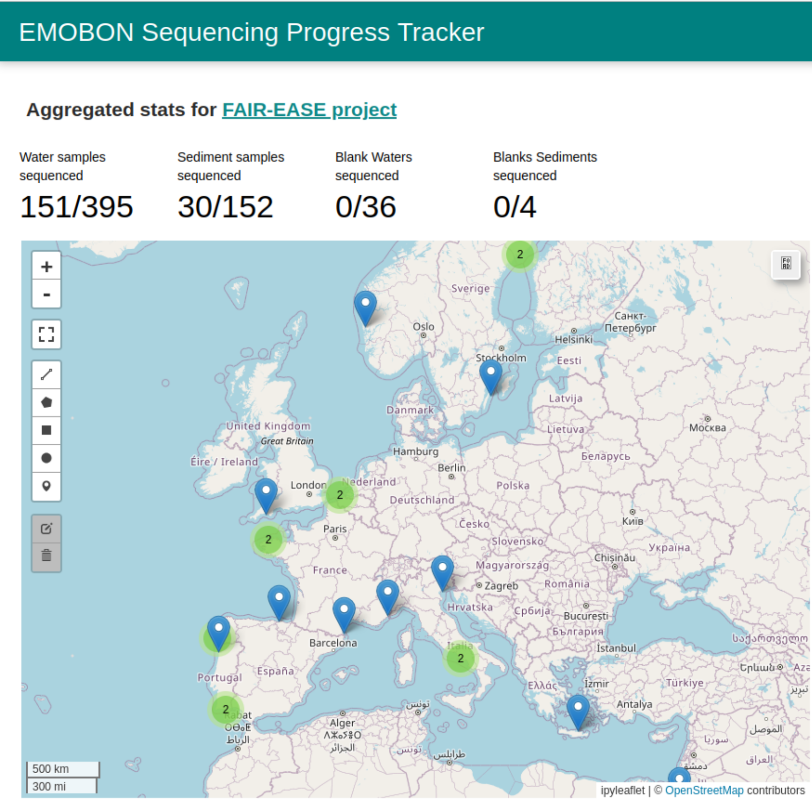

---
jupytext:
  formats: md:myst
  text_representation:
    extension: .md
    format_name: myst
    format_version: 0.13
    jupytext_version: 1.11.5
kernelspec:
  display_name: Python 3
  language: python
  name: python3
---

:::{note} Last update 👈
:class: dropdown
David Palecek, May 5, 2025
:::

# EMO-BON sequencing progress

Sequencing workflow uses [metaGOflow](https://doi.org/10.1093/gigascience/giad078) pipeline, which provides both taxonomic and functional outputs.

Here is the map of current European marine stations participating in sampling. The merged points likely means that the station collect both water column and sediment samples at slightly different locations.

In contrast to the numbers shown, the total number of samplings has reached more than 1000.



## Statistics per station

First get the required metadata

```{code-cell}
import pandas as pd
import ipywidgets as widgets

# manual hash table because names are pain in the backside and long
org_hash = {
    'EMT21': 'Toralla Marine Science Station',
    'UMF': 'Umea Marine Sciences Centre',
    'ROSKOGO': 'Station Biologique de Roscoff',
    'LMO': 'Linnaeus University',
    'BPNS': 'Flanders Marine Institute (VLIZ)',
    'ESC68N': 'The Arctic University of Norway (UiT)',
    'OOB': 'Observatoire Océanologique de Banyuls',
    'RFormosa': 'Centre of Marine Sciences (CCMAR)',
    'Bergen': 'University of Bergen (UiB)',
    'OSD74': 'CIIMAR Porto',
    'VB': 'Institut de la Mer de Villefranche',
    'MBAL4': 'Marine Biological Association, Plymouth',
    'HCMR-1': 'Hellenic Centre for Marine Research',
    'NRMCB': 'Stazione Zoologica Anton Dohrn',
    'PiEGetxo': 'Plentzia Marine Station',
    'IUIEilat': 'Interuniversity Institute for Marine Sciences in Eilat',
    'AAOT': 'Institute of Marine Science, (ISMAR)'
}


# statistics part
def get_stats(df: pd.DataFrame, hash) -> pd.DataFrame:
    # pivot table on run_status
    df_pivot = df.pivot_table(
      index="obs_id",
      columns=["run_status", 'batch'],
      values="organization",
      aggfunc="count",
    )

    df_pivot['sequenced'] = df_pivot.T.groupby(level=0).sum().T["COMPLETED"].astype(int)
    df_pivot["total"] = df.groupby("obs_id").count()["ref_code"].astype(int)
    df_pivot["percentage"] = round(df_pivot['sequenced'] / df_pivot["total"] * 100, ndigits=2)

    #replace Nan in run_status with 'queued'
    df['run_status'] = df['run_status'].fillna('queued')

    # remove lines which are not in org_hash
    df = df[df['obs_id'].isin(hash.keys())]
    df_pivot2 = df.pivot_table(
      index="obs_id",
      columns=["run_status", "sample_type"],
      values="organization",
      aggfunc="count",
    )
    return df_pivot, df_pivot2


url_tracker = "https://raw.githubusercontent.com/emo-bon/momics-demos/refs/heads/main/wf0_landing_page/emobon_sequencing_master.csv"
url_obs = "https://raw.githubusercontent.com/emo-bon/emo-bon-data-validation/refs/heads/main/validated-data/Observatory_combined_logsheets_validated.csv"
url_metadata = "https://raw.githubusercontent.com/emo-bon/emo-bon-data-validation/refs/heads/main/validated-data/Batch1and2_combined_logsheets_2024-11-12.csv"


# tracking csv file
df_obs = pd.read_csv(url_obs ,index_col=0)
df_tracker = pd.read_csv(url_tracker, index_col=False)

# change string that ';' is followed by a space
df_obs['organization'] = df_obs['organization'].str.replace('; ', ';')
df_obs['organization'] = df_obs['organization'].str.replace(';', '; ')


df_metadata = pd.read_csv(url_metadata ,index_col=0)

# Failed attempt to clean and shorted the org names automatically
organizations = df_obs[['organization']]

# remore duplicates
organizations = organizations.drop_duplicates()
organizations = organizations[organizations['organization'] != 'Estación de Ciencias Mariñas de Toralla - Centre of Marine Research, University of Vigo']

# add organization column from the df_obs to the df_tracker based on the obs_id
df_tracker = pd.merge(df_tracker, organizations, on="obs_id", how="left")


df_stats, df_aggregated = get_stats(df_tracker, org_hash)
# Reset index to merge properly
df_stats = df_stats.reset_index()

# Flatten the multi-level columns
df_stats.columns = ['_'.join(col).strip() if isinstance(col, tuple) else col for col in df_stats.columns]

df_stats = pd.merge(df_stats, organizations, left_on="obs_id_", right_index=True, how="left")
# remove trailing _ from the column names
df_stats.columns = df_stats.columns.str.rstrip('_')

# set index
df_stats.set_index('obs_id', inplace=True)


print(f"Current total of samplings: {df_stats['total'].sum()}")
df_stats.head()
```

Explore sequencing progress per sampling station:

```{code-cell}
import seaborn as sns
import matplotlib.pyplot as plt
from IPython.display import display, clear_output

toggle = widgets.ToggleButtons(
    options=['totals', 'percentages'],
    description='Display sequencing tracker per station in:',
    disabled=False,
    button_style='success',
)

plot_selector = widgets.Output()

def plot_stations(df, mode):
    with plot_selector:
        clear_output(wait=True)  # Clear previous output before drawing the new plot
        fig, ax = plt.subplots(figsize=(10, 6))
        if mode == "totals":
            sns.barplot(data=df, x=df.index, y="total", ax=ax)
            ax.set_ylabel("# samples sequenced")
            ax.set_title(f"Sequencing Tracker ({mode})")
        elif mode == "percentages":
            sns.barplot(data=df, x=df.index, y="percentage", ax=ax)
            ax.set_ylabel("% samples sequenced")
            ax.set_title(f"Sequencing Tracker ({mode})")
        ax.set_xlabel("station's ID")
        
        plt.xticks(rotation=45, ha='right')
        plt.tight_layout()
        plt.show()  # Ensure the figure is shown in notebook output

plot_stations(df_stats, "totals")

def on_value_change(change):
    with plot_selector:
        plot_stations(df_stats, change['new'])

# Observe changes in the toggle button
toggle.observe(on_value_change, names='value')

# Display the widgets and the plot
display(toggle)
display(plot_selector)
```
