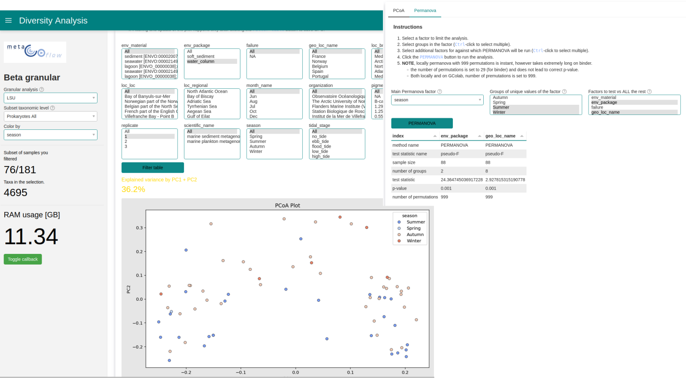

:::{note} Last update 👈
:class: dropdown
David Palecek, May 5, 2025
:::

# Genetic Diversity

Diversity dashboards currently summarize first 181 EMO-BON sampling events. They are split into two separate dashboards because of memory limits of the free (Binder or Colab) environments, but in principle they provide complementary functionality.

Jupyter Notebooks for the dashboards can be found [here](https://github.com/emo-bon/momics-demos/tree/main/wf2_diversity)

## Alpha and Beta diversity dashboard

Provides visualization of alpha and beta diversities of the metaGOflow analyses.

## Granular Beta diversity dashboard

This dashboard allows to pivot the tasonomy LSU and SSU tables, therefore is computationally more demanding.

Tables pivot species according to certain pre-selected taxa. Select, filter and visualize PCoA of the taxonomy in respect to categorical variables. In addition, you can calculate permanova on those subsampled taxonomy selections.

## Notes

Please raise issues and add/request features on the repository [Github](https://github.com/emo-bon/momics-demos/issues).

:::{tip} Memory usage
Not so useful per se, but since dashboards are single threaded, you can use the memory usage as indicator when the calculation or filtering is taking substantial time (usage callback will stop updating) meaning that you need only patience to wait until the execution finishes and dashboard updates.
:::
