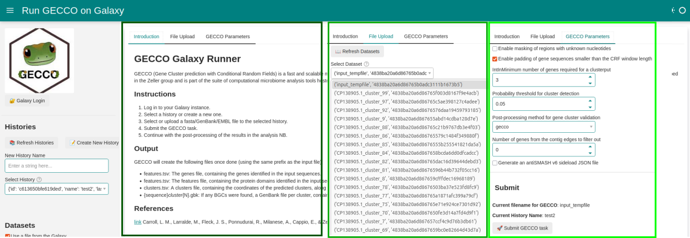
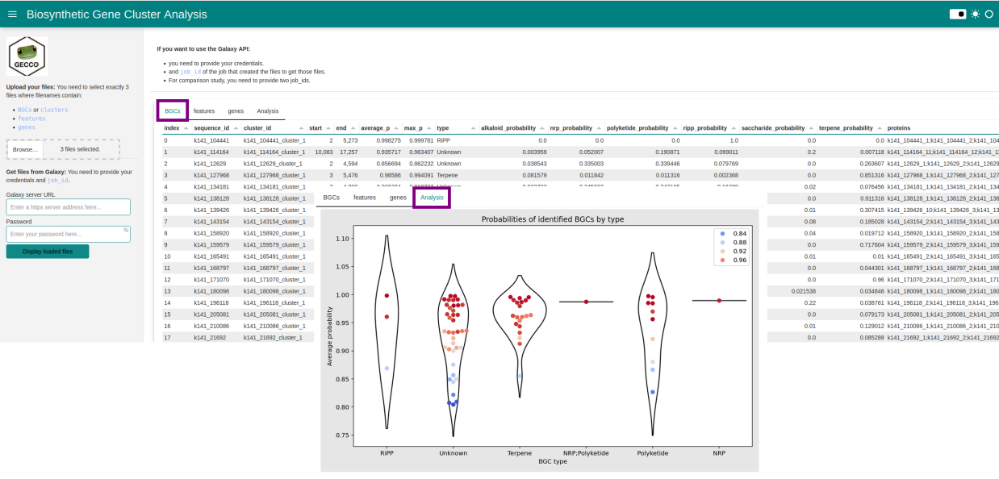

:::{note} Last update 👈
:class: dropdown
David Palecek, May 5, 2025
:::

# Biosynthetic Gene Clusters (BGCs)

BGCs are found using GECCO tool on the assembled contigs (fasta files) which can be invoked from the dashboard at Galaxy. Another dashboard is used to retrieve and visualize the results.

Jupyter Notebooks for the dashboards can be found [here](https://github.com/emo-bon/momics-demos/tree/main/wf3_gene_clusters)

## Running GECCO jobs on Galaxy

You will need an account on the galaxy [earth-system](https://earth-system.usegalaxy.eu/) for this NBs to work. Your Galaxy access data should be stored as environmental variables in the `.env` file at the root of the repository

```python
GALAXY_EARTH_URL="https://earth-system.usegalaxy.eu/"
GALAXY_EARTH_KEY="..."
```

:::{warning} BUG
:class: dropdown
For unknown reason the Binder version of the dashboard does not work.
:::

Dashboard illustrating submission of jobs to galaxy (GECCO tool):

1. Upload and run workflow.
2. Or start the workflow with existing data and in existing history on Galaxy.
3. Monitor GECCO job.

Jupyter NB can be found [here](https://github.com/emo-bon/momics-demos/blob/main/wf3_gene_clusters/bgc_run_gecco_job.ipynb)



## Analyze GECCO results

1. Upload local data or query results of the GECCO from the Galaxy.
2. Identifying Biosynthetic Gene Clusters (BGCs).
3. Visualize BGCs.



## Future directions

1. Compare two samples in respect to each other (separate dashboard/NB)
