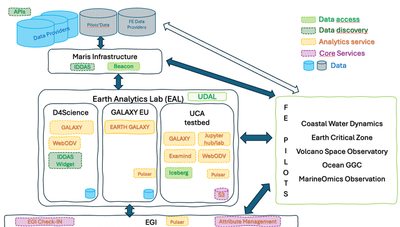

## Tools and Platforms Utilized

A combination of visualization web platforms, data access services, and custom scripts was employed to process and analyze the selected datasets:

### webODV[^2]
[https://webodv.awi.de/](https://webodv.awi.de/) – both on the FAIR-EASE testbed[^3] infrastructure and local desktop version – was used to explore and visualize:
- GEOTRACES data
- Helium isotope data
- Copernicus Marine Service – GlobColour products (Chlorophyll-a, BBP)
- Sea surface height and geostrophic current datasets
- BGC-Argo float profiles

### VolcPlume[^4]
[https://volcplume.aeris-data.fr/](https://volcplume.aeris-data.fr/) provided a key web platform to monitor the start and end dates of volcanic gas/particle emissions, as well as the spatial dispersion of volcanic plumes (including their content in SO₂, ash, sulfate aerosols, and ice crystals) related to both Hunga Tonga and Etna eruptions.

### EuroArgo Tools
- **Data Selection Portal**
- **Fleet Monitoring Interface**  
These tools were used to collocate Argo float trajectories in time and space with volcanic activity from Hunga Tonga and Etna.

### Custom Python Code
A dedicated script was developed during the Hackathon to read and visualize MODIS-Aqua Level-2 nFLH (Normalized Fluorescence Line Height) data, which has an unconventional NetCDF structure (not gridded, under-track format, using NetCDF grouping function).  
GitHub repository: **modis.py**

### MyOcean Pro
Used for rapid pre-visualization of Chlorophyll-a and BBP time series derived from Copernicus Marine Service products in the study region.

---

Some of these visualization platforms, data access services, and custom scripts have been deployed on the **FAIR-EASE testbed**. Figure 0 shows the overall test bed, which encompasses several infrastructures.  

In order to work on the interoperability between the data, a set of services have been deployed on a single infrastructure, namely the **UCA testbed**. This enabled testing of cloud format files and easy access to several analytical services.  

*Note:* Figure 0 contains only the infrastructure where new services have been deployed, not the ones (such as VolcPlume, existing webODV instances…) that already existed.

*Figure 0: FAIR-EASE infrastructure testbed*

[^2]: webODV is an online data exploration and visualization platform developed as a web-based extension of the widely used Ocean Data View (ODV) software. It enables users to interactively explore, subset, and visualize large oceanographic and environmental datasets without requiring local software installation.
[^3]: The testbed is a datalake infrastructure at UCA mesocentre
[^4]: VolcPlume is a web-based visualization and analysis platform developed by Univ. Lille/LOA and AERIS/ICARE to monitor and study volcanic gas/particle emissions using satellite and ground data. It integrates a wide range of remote sensing products to track the emission and dispersion of volcanic plumes in the atmosphere (in near-real time or retrospectively).
---