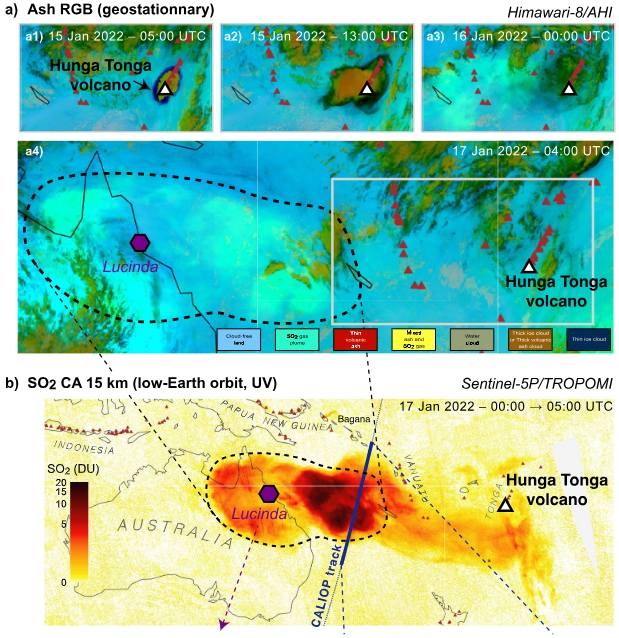
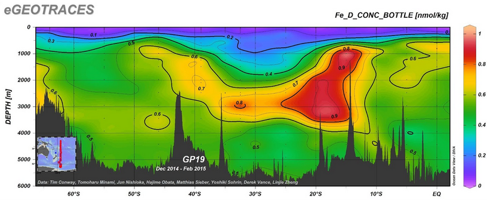
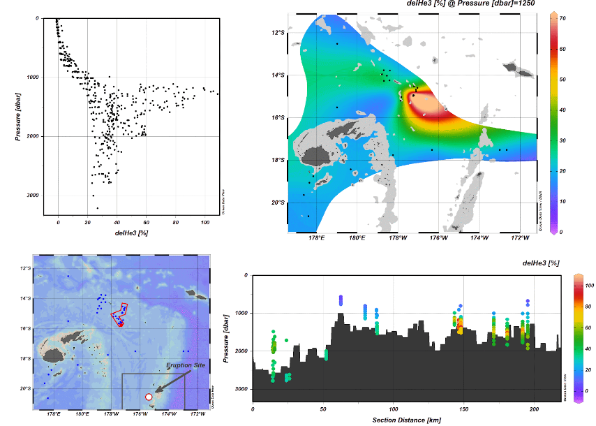
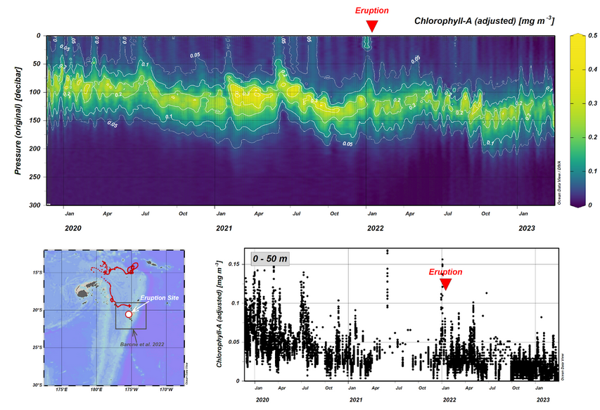
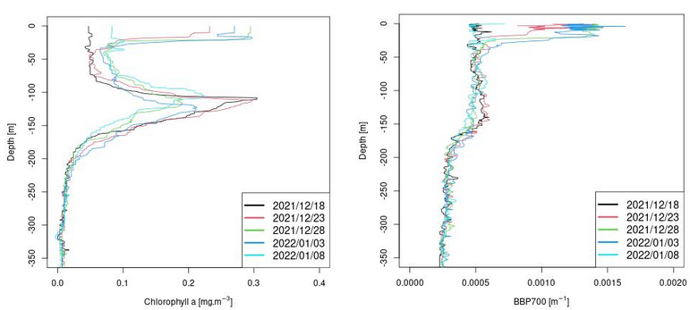
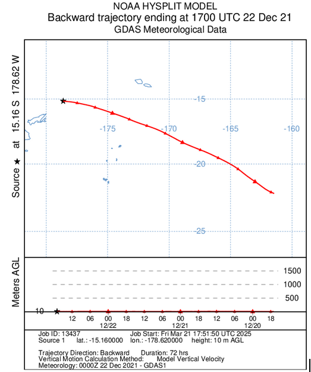

# 2. Results

This section presents the key findings of the study, integrating multiple data sources to evaluate the potential impact of the Hunga Tonga volcanic eruption on ocean biogeochemistry and biological activity. The results are organized around the main components of the analysis: atmospheric plume dispersion, ocean surface anomalies detected by satellite remote sensing, in situ Argo float observations, and geochemical signatures from water samples. Comparative insights from the Etna case study are also included to support the broader interpretation.

## 2.1. Hunga Tonga Eruption and Associated Volcanic Plume

To contextualize the oceanic observations, the initial focus of our results centers on the volcanic plume generated by the Hunga Tonga eruption. Using the **VolcPlume** platform, we tracked the spatial and temporal evolution of ash and gas emissions during the eruptive period.

*Figure 1: This image presents a representative snapshot extracted from Boichu et al. (2023) [DOI: 10.1029/2023JD039010]*

The previous figure 1 illustrates the ash plume dispersion during the main explosive phase in January 2022. The image highlights the extensive release of volcanic material into the atmosphere, with the ash plume (shown in black) clearly visible and radiating from the eruption site.

Notably, plume activity was detected as early as December 19, 2021 (see figure 2), marking the onset of significant emissions prior to the paroxysmal event of January 15. These early phases are particularly relevant to interpreting anomalies observed in satellite ocean colour products and biogeochemical measurements in the following sections.

<video width="640" height="360" autoplay loop muted>
  <source src="volcplume_2.mp4" type="video/mp4">
</video>
*Figure 2: Image of the ash plume (Black colors) distribution resulting from the first Hunga Tonga eruption starting by the end of December 19th, 2021*

---

## 2.2. Subsurface Geochemical Signatures: GEOTRACES and Helium Data

To further investigate the potential influence of submarine volcanic activity associated with the Hunga Tonga eruption, we examined trace metal and isotopic data from the **GEOTRACES IDP2021** database. These geochemical indicators provide valuable insight into the presence and vertical extent of hydrothermal and volcanic inputs in the surrounding water column.

*Figure 3: Image of the dissolved iron (Fe) concentrations along the GEOTRACES GP19 transect*
Analysis of dissolved iron (Fe) concentrations along the GEOTRACES GP19 transect, located approximately 500 km east of the eruption site, revealed elevated Fe levels between 3500 m and 750 m depth. These anomalies are consistent with inputs from both hydrothermal venting and volcanic sources (see figure 3).

Additionally, helium-3 (³He) isotope measurements north of the eruption site indicated a pronounced hotspot centered at approximately 1300 m depth, further supporting the presence of a significant subsurface volcanic signal (see figure 4).

*Figure 4: Image of helium-3 (³He) isotope measurements*

Together, these findings suggest that the Hunga Tonga event may have contributed to localized enrichment in trace elements, reinforcing the relevance of submarine processes in the broader interpretation of post-eruption biogeochemical changes.

---

## 2.3. In Situ Observations from BGC-Argo Floats

To complement satellite-based and geochemical observations, we analyzed in situ biogeochemical data collected by **BGC-Argo float 6903024** (see figure 5), which was located approximately 700 km from the Hunga Tonga eruption site during the study period. This float is equipped with sensors measuring:
- Chlorophyll-a (CHLA) via fluorescence
- Particulate backscattering (BBP) at 700 nm

*Figure 5: Graphics on the BGC-Argo float 6903024 data*

Chlorophyll-a concentrations were examined over the upper 300 meters and more specifically within the upper 50 meters of the water column. The timeline of the main eruption on January 15, 2022, was used as a reference to assess any biological responses in the water column.

Interestingly, a distinct surface signal (see figure 6) is observed in three consecutive profiles between December 23, 2021, and January 3, 2022, prior to the main eruptive phase.

*Figure 6: Signals of the BGC-Argo float 6903024 of Chlorophyll A and BBP*

These anomalies align with a period during which the VolcPlume platform confirmed the presence of an ash plume passing over the float’s location.

To investigate the source and movement of the atmospheric plume, **HYSPLIT** back trajectory analysis was performed ([NOAA HYSPLIT](https://www.ready.noaa.gov/HYSPLIT.php)), further supporting the hypothesis of particle deposition influencing surface waters during this period.

*Figure 7: Figure of the HYSPLIT back trajectory analysis*

Given the presence of this early biological or particle-related signal, it raises the question of whether the chlorophyll-a concentration scale used in earlier studies (e.g., Barone et al., with a maximum CHLA value of 0.3 mg/m³) may underestimate localised variations. Our observations suggest more significant dynamics, potentially extending further north than initially described.

---

## 2.4. Satellite Ocean Colour Observations: Copernicus L3 (BBP and CHLA) and MODIS-Aqua L2 (nFLH)

*(Content placeholder for BBP and CHLA/nFLH details)*

---

## 2.5. Surface Circulation Patterns from Sea Surface Height

To better understand the potential dispersion pathways of ash and surface anomalies, we examined sea surface height (SSH) contours and derived geostrophic surface currents on the day of the Hunga Tonga eruption (**January 15, 2022**) (see figure 8). The map includes the eruption site as well as the study area defined in Barone et al. (2022), providing a spatial framework to interpret the movement of surface water masses in relation to the volcanic event.

*Figure 8: Sea circulation pattern*

---

## 2.6. Preliminary Biological Observations

As a relevant precedent, Dragone et al. (2022) ([DOI: 10.1128/mbio.03313-22](https://doi.org/10.1128/mbio.03313-22)) documented the early colonization of the newly formed Hunga Tonga island by diverse microbial communities following its emergence in 2015. Their study suggests that these microbial populations likely originated from adjacent geothermal environments, highlighting the potential for rapid biological responses in volcanic settings.

**BBP and Chlorophyll-A data from COPERNICUS data**